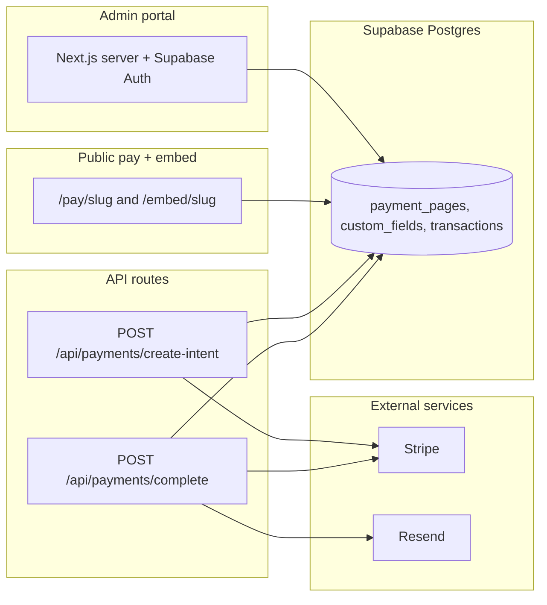

# Quick Payment Pages (QPP)

Hosted, configurable payment pages for the **Waystar QPP hackathon**: providers configure branding, amounts, GL codes, custom fields, and confirmation emails; payers complete checkout on a public URL, embedded iframe, or QR code. Built with **Next.js (App Router)**, **Supabase** (Postgres + Auth + RLS), **Stripe** (test mode + Payment Element), and **Resend**.

## Architecture

- **Row Level Security**: Active payment pages and their fields are readable anonymously for public rendering. All writes to `payment_pages` / `custom_fields` require an authenticated admin who owns the row. `transactions` and `field_responses` inserts use the **service role** from the server after Stripe confirms payment.
- **Payments**: `create-intent` validates amount against the page configuration and custom fields server-side. `complete` verifies the PaymentIntent with Stripe, persists the row idempotently, and sends email via Resend.
- **Differentiator**: Optional **trust & transparency** panel per page (plain text) plus built-in copy on security and email receipts—aimed at municipal and professional services use cases.

## API (HTTP)

| Method & path | Purpose |
|---------------|---------|
| `POST /api/payments/create-intent` | Body: `{ slug, amount, payer_email, payer_name, field_values }`. Returns `{ clientSecret }` for Stripe Elements. |
| `POST /api/payments/complete` | Body: `{ payment_intent_id, slug, amount, payer_email?, payer_name?, field_values }`. Verifies Stripe, writes `transactions` + `field_responses`, sends confirmation email. |

All secrets stay in environment variables; nothing sensitive is exposed to the browser except the Stripe publishable key.

## Local setup

1. **Clone** and install dependencies: `npm install`
2. **Supabase**: A project **`quick-payment-pages`** (ref `wqnblnufijvkuhmgvcjp`, region `us-east-1`) was provisioned via MCP; schema migrations are applied (`payment_pages`, `custom_fields`, `transactions`, `field_responses`, RLS). Copy **Project URL** + **anon** + **service_role** keys from [API settings](https://supabase.com/dashboard/project/wqnblnufijvkuhmgvcjp/settings/api) into `.env.local` (a starter `.env.local` may already list the URL and anon key).
3. **Auth**: In [URL configuration](https://supabase.com/dashboard/project/wqnblnufijvkuhmgvcjp/auth/url-configuration), set **Site URL** to `http://localhost:3000` for local dev and add **Redirect URLs**: `http://localhost:3000/auth/callback` plus your production URL (e.g. `https://YOUR_VERCEL_DOMAIN/auth/callback`).
4. **Stripe**: The Stripe MCP is tied to your existing Stripe account (no separate “Stripe project” is created via API). Add **test** publishable + secret keys from the [Stripe API keys page](https://dashboard.stripe.com/acct_1TPOJFE8DesW9UPx/apikeys) to `.env.local`. The app uses PaymentIntents only (no Stripe Products required).
5. **Copy env**: Use `.env.example` as a checklist; ensure `.env.local` has all variables (especially `SUPABASE_SERVICE_ROLE_KEY` for recording payments).
6. **Run**: `npm run dev` → [http://localhost:3000](http://localhost:3000)

### Environment variables

| Variable | Where used |
|----------|------------|
| `NEXT_PUBLIC_SUPABASE_URL` | Browser + server Supabase clients |
| `NEXT_PUBLIC_SUPABASE_ANON_KEY` | Browser + server (RLS) |
| `SUPABASE_SERVICE_ROLE_KEY` | Server only: insert transactions after payment |
| `NEXT_PUBLIC_STRIPE_PUBLISHABLE_KEY` | Stripe.js |
| `STRIPE_SECRET_KEY` | PaymentIntents |
| `RESEND_API_KEY` | Transactional email |
| `RESEND_FROM_EMAIL` | From header (verify domain in production) |
| `NEXT_PUBLIC_APP_URL` | Public links, iframe base, QR codes |

## Deploy on Vercel

1. Push the repo to GitHub/GitLab and import the project in Vercel.
2. Add the same environment variables in the Vercel project settings (use **production** Stripe/Resend/Supabase values when you go live).
3. Update Supabase Auth redirect URLs to include `https://YOUR_VERCEL_DOMAIN/auth/callback`.
4. Redeploy.

## Demo checklist (hackathon)

1. Sign up / sign in, create **two** payment pages (e.g. fixed fee + open donation).
2. Open **Distribution** on each: copy URL, iframe HTML, download QR SVG.
3. Pay with a [Stripe test card](https://stripe.com/docs/testing) (e.g. `4242 4242 4242 4242`).
4. Confirm the row appears under **Reports** and that Resend delivers mail (check spam; Resend test sender limits apply).

## Tech choices

- **Stripe**: Strong test-mode tooling, Payment Element for card collection (billing postal code via Element), and clear payment-method metadata for reporting.
- **Supabase**: Postgres + Auth + RLS match the relational model (pages, fields, transactions) and keep the admin boundary explicit.
- **Resend**: Simple transactional API for HTML confirmations with merge variables.

## Accessibility

Public payment routes use labeled controls, `aria-describedby` / `role="alert"` for errors, skip link, keyboard-focus styles, and sufficient contrast on form surfaces. Run Lighthouse or axe on `/pay/your-slug` before demo.

## Security note

If an API key is ever pasted into chat or committed, **rotate it** in the provider dashboard and update Vercel/local env only.
